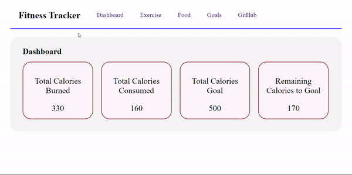

# Fitness Tracker

The Fitness Tracker is a web application designed to help users track their fitness goals, including exercise routines, food intake, and fitness goals. It provides a dashboard with summarized data, allows users to add and remove exercises, record their food consumption, and set fitness goals.

#### Live Link - https://fitness-tracker-app-flame.vercel.app/
#### Backend - https://github.com/ShivamT16/assignment-17

## Features-

Dashboard-  
Displays summary of fitness metrics
<li>Total Calories Burned</li>
<li>Total Calories Consumed</li>
<li>Total Calories Goal</li>
<li>Remaining Calories to Goal</li>  
 

Exercise Tracking-  
Display/Add or Remove list of exercises.

Food Tracking-  
Display/Add or Remove list of food items.

Goal Tracking-  
Display/Add or Remove list of fitness goals.

## Tech Used

Frontend-  
Javascript  
HTML  
ReactJs  
Redux  

Backend-  
NodeJs  
Express  
MongoDB  
